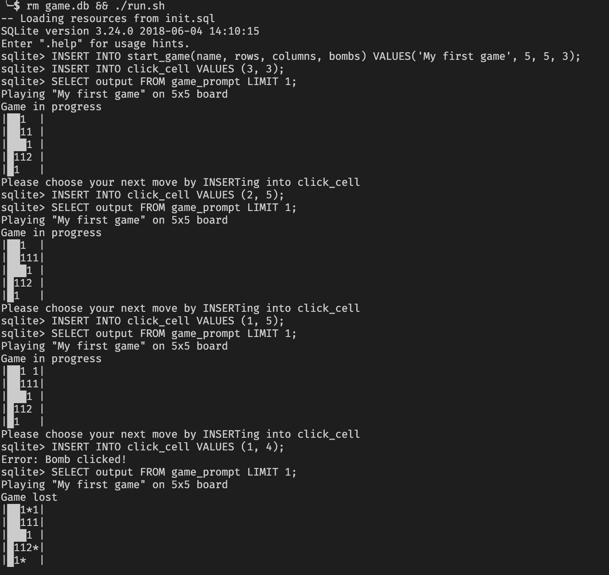

# Full Minesweeper Implementation in SQLite

## How to play

* Start an in-memory sqlite console by executing `run.sh` 
* To start a game, INSERT into `start_game(name, rows, columns, bombs)`, e.g. to start a game titled 'My First Game' on a 5x5 board with 5 bombs, `INSERT INTO start_game(name, rows, columns, bombs) VALUES('My First Game', 5, 5, 5);` 
* To get an ASCII-Art rendering of the game status, execute `SELECT output FROM game_prompt;`
* To click a cell, INSERT into `click_cell(row, column)`. e.g. to click the cell in row 3, column 4: `INSERT INTO click_cell(3, 4);`
* To add a flag to a cell, INSERT into `flag_cell(row, column)`. To remove a flag, INSERT into `unflag_cell(row, column)`.
* In the board overview, unknown cells are blank, clicked, empty cells are displayed as a filled block, and flags are 'F'.
* After the game has finished, the board overview will also show bombs as '*', misplaced flags as 'ꟻ', and clicked bombs as '!'
* Exit the game by pressing CTRL+D or entering `.quit`

## Example session:
Screenshot of a game that ended in a loss:


Transccript of a successful game:
```
SQLite version 3.24.0 2018-06-04 14:10:15
Enter ".help" for usage hints.
sqlite> INSERT INTO start_game(name, rows, columns, bombs) VALUES('My first game', 5, 5, 5);
sqlite> SELECT output FROM game_prompt;
Playing "My first game" on 5x5 board
Game in progress
|     |
|     |
|     |
|     |
|     |
Please choose your next move by INSERTing into click_cell

sqlite> INSERT INTO click_cell VALUES(3,3);
sqlite> SELECT output FROM game_prompt;
Playing "My first game" on 5x5 board
Game in progress
|     |
| 1111|
| 1███|
| 2211|
|     |
Please choose your next move by INSERTing into click_cell

sqlite> INSERT INTO click_cell VALUES(1, 3);
sqlite> SELECT output FROM game_prompt;
Playing "My first game" on 5x5 board
Game in progress
|  1  |
| 1111|
| 1███|
| 2211|
|     |
Please choose your next move by INSERTing into click_cell

sqlite> INSERT INTO flag_cell VALUES (5, 2);
sqlite> INSERT INTO click_cell VALUES(5, 5);
sqlite> SELECT output FROM game_prompt;
Playing "My first game" on 5x5 board
Game in progress
|  1  |
| 1111|
| 1███|
| 2211|
| F  1|
Please choose your next move by INSERTing into click_cell

sqlite> INSERT INTO flag_cell VALUES (5, 4);
sqlite> INSERT INTO click_cell VALUES(5, 3);
sqlite> SELECT output FROM game_prompt;
Playing "My first game" on 5x5 board
Game in progress
|  1  |
| 1111|
| 1███|
| 2211|
| F2F1|
Please choose your next move by INSERTing into click_cell

sqlite> INSERT INTO click_cell VALUES(3, 1);
sqlite> SELECT output FROM game_prompt;
Playing "My first game" on 5x5 board
Game in progress
|  1  |
| 1111|
|11███|
| 2211|
| F2F1|
Please choose your next move by INSERTing into click_cell

sqlite> INSERT INTO click_cell VALUES(1,5);
sqlite> SELECT output FROM game_prompt;
Playing "My first game" on 5x5 board
Game in progress
|  1 1|
| 1111|
|11███|
| 2211|
| F2F1|
Please choose your next move by INSERTing into click_cell

sqlite> INSERT INTO click_cell VALUES(1,2);
sqlite> SELECT output FROM game_prompt;
Playing "My first game" on 5x5 board
Game in progress
| 11 1|
| 1111|
|11███|
| 2211|
| F2F1|
Please choose your next move by INSERTing into click_cell

sqlite> INSERT INTO click_cell VALUES(1,1);
sqlite> SELECT output FROM game_prompt;
Playing "My first game" on 5x5 board
Game in progress
|111 1|
| 1111|
|11███|
| 2211|
| F2F1|
Please choose your next move by INSERTing into click_cell

sqlite> INSERT INTO flag_cell VALUES (2, 1);
sqlite> SELECT output FROM game_prompt;
Playing "My first game" on 5x5 board
Game in progress
|111 1|
|F1111|
|11███|
| 2211|
| F2F1|
Please choose your next move by INSERTing into click_cell

sqlite> INSERT INTO click_cell VALUES(4, 1);
sqlite> SELECT output FROM game_prompt;
Playing "My first game" on 5x5 board
Game won
|111*1|
|*1111|
|11███|
|22211|
|**2*1|
```